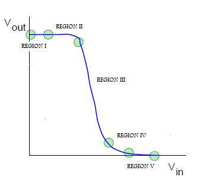

**INVERTER: BASIC OPERATION**

An inverter is a fundamental logic gate with one input and one output. Its output is always the complement of the input: if the input is 0, the output is 1, and vice versa.

Symbol:

Truth Table:

| Input | Output |
|-------|--------|
|   0   |   1    |
|   1   |   0    |

The transistor-level schematic of an inverter can be designed using different logics. In this experiment, we focus on two approaches:
1. CMOS logic
2. Pseudo NMOS logic

**CMOS INVERTER**

In the transistor-level design of a CMOS inverter, NMOS and PMOS transistors are arranged in series. The PMOS transistor is connected between Vdd and the output node, whereas the NMOS is connected between the output node and ground.

**WORKING OF CMOS INVERTER**

Before knowing the working of CMOS inverter we will see the regions of operation of transistor so that we can understand what is actually happening inside the inverter. MOS transistors have three regions of operations :

  1. Cut-off region
  2. Linear region
  3. Saturation region

The transistor is said to be in **cut-off** region when Vgs < Vt. Vgs is the voltage applied at gate with respect to source and Vt is the threshhold voltage below which the transistor does not work. So for transistor to work Vgs - Vt should be greater than zero always.

The transistor is in linear region when Vgs - Vt > Vds where Vds is the voltage at drain with respect to source.

The transistor is said to be in saturation region when vgs - Vt < Vds

The transfer characteristic(i.e. the output voltage vs input voltage) is shown in the figure below. The operation is divided into 5 regions depending on the range of input voltage. The output voltage in every region is obtained by equating drain to source current of pmos and nmos.

**EFFECT OF W/L RATIO ON OUTPUT WAVEFORM**

Before proceeding to the study of effect please read the definition of β (gain factor).

W/L ratio is directly proportional to β. The ratio βn/βp is crucial in determinig the transfer characteristic of the inverter. When the ratio is increased the transition shifts from left to right, but the output voltage transition remains sharp. For CMOS the ratio is desired to be 1 so that it requires equal time to charge and discharge.

**EFFECT OF CAPACITANCE ON THE RISE AND FALL TIME**

The rise time is defined as the time required to charge the capacitor from 10% to 90% and fall time is defined as the time required for the capacitor to discharge from 90% to 10%.

Greater value of capacitor implies larger rise and fall time, which further implies large delay. The rise time and fall time are directly proportional to the capacitance. Therefore, greater the value of capacitance, greater will be the time taken for rising and falling.

**PSEUDO NMOS**

The gate of p-device is permanently grounded which is equivalent to use of NMOS in depletion mode

**SOME BASIC DEFINITIONS AND THEORY**

**TRANSISTOR**

Basically transistor consists of three parts - GATE, SOURCE and DRAIN as shown in figure below:

The gate is a control input which determines the flow of electric current between source and drain. Physically drain and source are equivalent and the two types of transistor i.e. n-transistor and p-transistor differ only in the way electric current flows between source and drain according to the different values applied at the controlling gate input. In n-transistor when logic 1 is aplied to gate, the current flows bwetween source and drain while no current flows when logic 0 is applied. The p-transistor works just the opposite way - the current flows between source and drain when logic 0 is applied and no current on logic 1.

**β - GAIN FACTOR**

β is the MOS transistor gain factor which depends both on process parameters and geometry parameters.
β = k(W/L)
where K is the factor which shows process dependency
and W & L shows geometry dependency

For NMOS, gain factor is denoted by βn and for PMOS, gain factor is denoted by βp.

**DELAY**

Delay time is the time taken for the input transition (50% level) into output (50% level). The single gate delay is given by the average of rise time and fall time, so delay also is directly proportional to the capacitance value

**DEPLETION MODE**

Using NMOS in depletion region means increasing negative voltage on the gate to reduce current flow or we can say to deplete the channel of free carriers which are electrons in n-channel.
